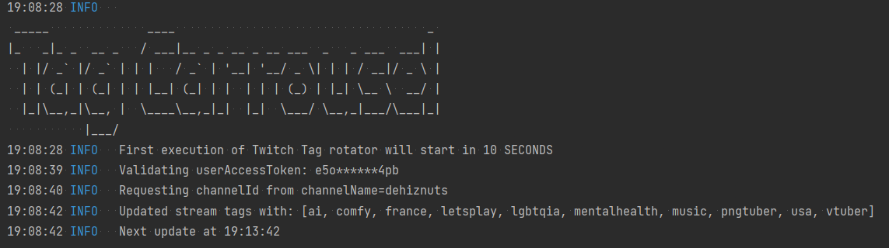

# How to Set Up The Application

Welcome to my application! This guide will help you set up the application and get started with using it for your Twitch channel.

## Step 1: Download the Application

1. Download the Java 17 Runtime environment: https://download.oracle.com/java/17/latest/jdk-17_windows-x64_bin.msi  
1. Download the `twitch-tag-carrousel.jar` application: https://github.com/dehidehidehi/twitch-tag-carrousel/releases/download/v1.0.0/twitch-tag-carousel-jar-with-dependencies.jar
1. Make a copy of the `user.properties` file and place it next to where you placed the `twitch-tag-carrousel.jar`

## Step 2: Specify Your Channel Name

Open the `user.properties` file and locate the line that says `twitch-app.channel-name=YOUR_CHANNEL_NAME_HERE`. Replace 
`YOUR_CHANNEL_NAME_HERE` with the name of your Twitch channel.

## Step 3: Set the Tag Rotation Frequency

In the `user.properties` file, locate the line that says `twitch-app.tag-rotation-frequency-seconds=300`. This specifies 
the frequency at which your tags will be updated in seconds. The default setting is 300 seconds (5 minutes), but you 
can change this to any value you prefer.

## Step 4: Obtain Your User Access Token

To use this application, you will need to obtain a user access token from Twitch. Follow these steps to get your token:

1. Go to the following link: https://id.twitch.tv/oauth2/authorize?client_id=6k3qz1pdf1wko4xec9cjbfh3fbla24&redirect_uri=http://localhost&response_type=token&scope=channel%3Amanage%3Abroadcast
2. Accept the authorization request.
3. Copy the access token from the URL bar.

Once you have obtained your user access token, locate the line in the README.md file that says `twitch-app.user-access-token=YOUR_USER_ACCESS_TOKEN_HERE`. Replace `YOUR_USER_ACCESS_TOKEN_HERE` with your user access token.

## Step 5: Set Your Tags

In the `user.properties` file, you will see two sections for setting your tags: `tag-carousel.mandatory-tags` and 
`tag-carousel.tags`.

### Mandatory Tags

Under `tag-carousel.mandatory-tags`, set the tags that you always want to be included with your stream. Separate the tags by a comma. You cannot set more than 10 tags. Each tag cannot be longer than 25 characters and cannot include special characters or whitespaces.

### Tag Carousel

Under `tag-carousel.tags`, set the tags that you want to cycle through as you stream. The order is not important, as they will be shuffled at each start of the application. Separate the tags by a comma. Each tag cannot be longer than 25 characters and cannot include special characters or whitespaces.

## Step 6: Run the Application

You're all set! Save the changes to the `user.properties` file and run the application. Your Twitch tags will now be 
automatically updated according to the settings you specified. Enjoy streaming!
